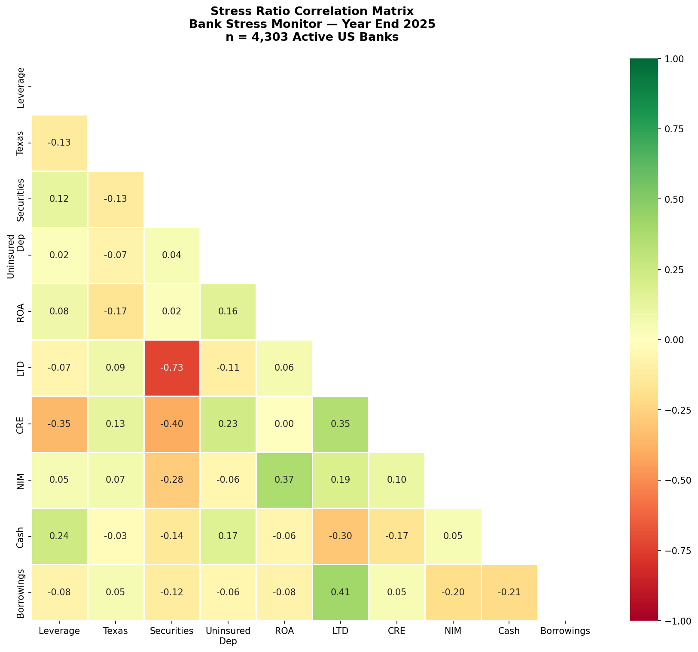
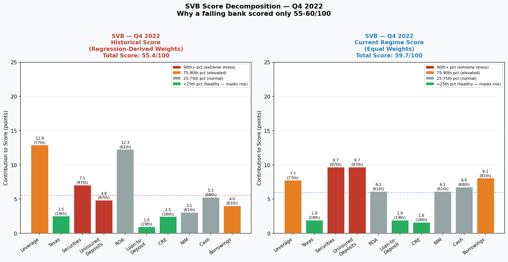
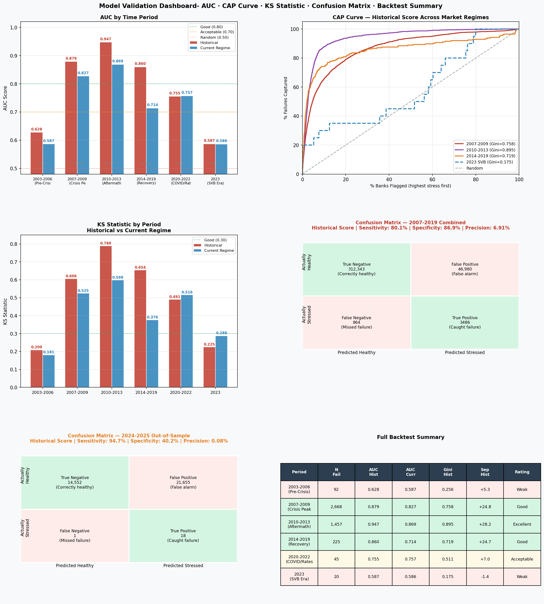
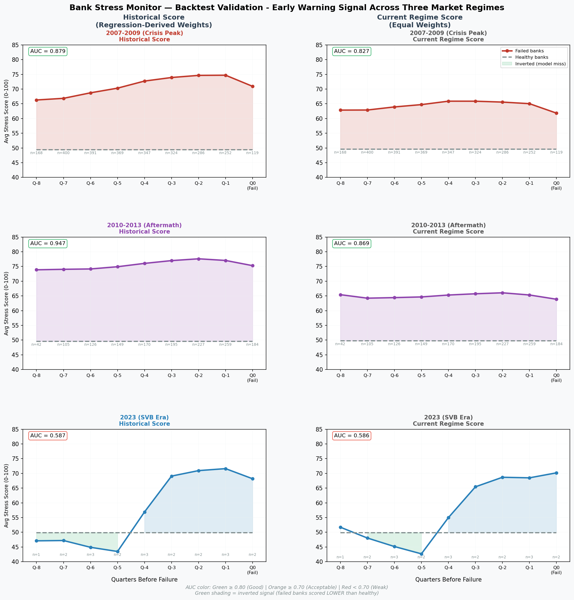

# Bank Stress Monitor
### End-to-End Credit Risk Model | 4,303 US Banks | FDIC Public Data


---

## Overview

A complete bank stress monitoring system covering all 4,303 active US banks,
built using 20 years of FDIC public call report data. The model uses logistic
regression trained on 4,491 historical bank failures (2003-2023) to derive
data-driven weights for 10 financial stress ratios.

Two composite scores are produced for each bank:

- **Historical Score** — regression-derived weights calibrated on 2008-era
  credit failures. Strong predictive power for traditional credit-quality stress
  (AUC 0.947 during 2010-2013 aftermath).
- **Current Regime Score** — equal weights giving 2× more emphasis to
  run-risk metrics like uninsured deposits. Designed to capture SVB-type
  structural vulnerabilities that historical data underrepresents.

> *"SVB scored 55/100 despite extreme securities concentration (97th percentile)
> and uninsured deposit risk (97th percentile). Its strong profitability masked
> structural vulnerabilities — exactly why two scores are needed."*

---

## Motivation

The 2023 collapse of Silicon Valley Bank exposed a critical gap in traditional
bank stress monitoring: models calibrated on 2008-era credit failures
systematically underweight rate risk and run risk. SVB had strong profitability,
excellent credit quality, and adequate capital — yet failed within 48 hours due
to structural vulnerabilities invisible to historical models.

This project addresses that gap by building a two-score framework that
separately captures:
- **Credit-quality stress** — the dominant failure mode of 2008-2012
- **Structural/liquidity stress** — the emerging failure mode of 2023+

All data is sourced from the FDIC public API — no proprietary data required,
fully reproducible.

---

## Data Source

| Item | Detail |
|------|--------|
| Source | FDIC Public API (banks.data.fdic.gov) |
| Training period | 2003 Q1 — 2023 Q4 |
| Training observations | 587,294 bank-quarter records |
| Historical failures | 4,491 FDIC-confirmed bank failures |
| Current snapshot | 2025 Q4 — 4,303 active banks |
| Fields used | 20 call report fields per quarter |

Data is pulled directly from the FDIC API with no manual downloads required.
All fields are from quarterly Call Reports (FFIEC 041/051) filed by every
FDIC-insured institution.

---

## Methodology

### 1. Ten Stress Ratios

Ten financial ratios covering six risk dimensions, calculated from FDIC call
report data each quarter:

| Ratio | Formula | Risk Dimension | Stress Direction |
|-------|---------|---------------|-----------------|
| Leverage Ratio | Tier 1 Capital / Total Assets | Solvency | Low = stressed |
| Texas Ratio | Non-Performing Assets / (Tangible Common Equity + Loan Loss Reserves) | Asset Quality | High = stressed |
| Securities Ratio | Total Securities / Total Assets | Rate Risk | High = stressed |
| Uninsured Deposits | Uninsured Deposits / Total Deposits | Run Risk | High = stressed |
| Return on Assets | Net Income / Total Assets | Profitability | Low = stressed |
| Loan-to-Deposit | Total Loans / Total Deposits | Liquidity | High = stressed |
| CRE Concentration | CRE Loans / (Tier 1 + Tier 2 Capital) | Concentration | High = stressed |
| Net Interest Margin | Net Interest Income / Total Assets | Earnings Quality | Low = stressed |
| Cash Ratio | Cash & Balances / Total Assets | Liquidity Buffer | Low = stressed |
| Borrowings Ratio | Other Borrowed Funds / Total Assets | Funding Stability | High = stressed |

> **Note:** NIM is divided by total assets rather than earning assets for
> consistency. This results in a systematic ~0.4% understatement vs published
> figures but is consistent across all banks — relative comparisons remain valid.

> **CRE threshold:** The 300% regulatory threshold comes from 2006 FDIC/OCC
> joint guidance — banks above it are subject to enhanced supervisory scrutiny.

### Regulatory Framework Alignment

The 10 ratios map directly onto the **CAMELS** supervisory framework used
by US bank regulators (FDIC, OCC, Federal Reserve):

| CAMELS Component | Ratios Covered |
|-----------------|---------------|
| **C**apital Adequacy | Leverage Ratio, CRE Concentration |
| **A**sset Quality | Texas Ratio, CRE Concentration |
| **M**anagement | — (qualitative, not captured in call report data) |
| **E**arnings | ROA, Net Interest Margin |
| **L**iquidity | Cash Ratio, Loan-to-Deposit, Borrowings Ratio |
| **S**ensitivity to Market Risk | Securities Ratio, Uninsured Deposits |

### Ratio Correlation Matrix

The 10 ratios show low pairwise correlations — confirming each ratio
captures a genuinely distinct risk dimension. The one notable exception
is Securities Ratio vs Loan-to-Deposit at -0.73, reflecting a balance
sheet tradeoff: banks that lend heavily tend to hold fewer securities.
Both ratios were retained as they capture different stress mechanisms.



The Leverage Ratio threshold (≥ 5% for well-capitalized) and CRE
Concentration threshold (≤ 300%) are both grounded in **Basel III**
capital adequacy standards and 2006 FDIC/OCC joint guidance respectively.

> **Note:** Management (M) is excluded as it requires qualitative
> supervisory judgment not available in public call report data.

### 2. Size Tiers

Banks are divided into four size tiers. All percentile scoring is calculated
within each tier — ensuring community banks are only compared to other
community banks, not to JPMorgan.

| Tier | Asset Size | Count (2025 Q4) |
|------|-----------|----------------|
| Community | < $1B | 3,262 (75.8%) |
| Mid-Size | $1B — $10B | 888 (20.6%) |
| Large Regional | $10B — $100B | 122 (2.8%) |
| Large | > $100B | 31 (0.7%) |

### 3. Percentile Scoring

Each ratio is converted to a stress percentile (0-100) within its size tier:
- **High = stressed ratios** (Texas, CRE, Securities etc.): ranked low to high
- **Low = stressed ratios** (ROA, Leverage, NIM etc.): ranked high to low

A score of 80 means the bank is more stressed than 80% of its peers on that
ratio. Scores are peer-relative — not absolute thresholds.

### 4. Weight Derivation

Logistic regression trained on 587,294 bank-quarter observations (2003-2023):

- **Target:** DEFAULT = 1 if bank failed within 2 years
- **Features:** 20 (10 ratios + 10 QoQ trends)
- **Trend handling:** Trends included during training to improve weight
  calibration accuracy — not included in final composite score
- **Class weight:** Balanced — addresses 1:130 class imbalance
- **Regularization:** C=0.1 — prevents any single feature from dominating
- **Weight constraints:** 5% floor (no ratio ignored) + 20% cap (ROA)
- **Training AUC:** 0.956

Final Historical Score weights:

| Ratio | Weight | Note |
|-------|--------|------|
| Return on Assets | 20.0% | Capped from 35.9% raw |
| Leverage Ratio | 16.7% | |
| CRE Concentration | 15.2% | |
| Texas Ratio | 13.1% | |
| Cash Ratio | 7.8% | |
| Securities Ratio | 7.3% | |
| Uninsured Deposits | 5.0% | Floored |
| Loan-to-Deposit | 5.0% | Floored |
| Net Interest Margin | 5.0% | Floored |
| Borrowings Ratio | 5.0% | Floored |

### 5. Two Composite Scores
```
Historical Score     = Σ (stress_percentile × regression_weight)
Current Regime Score = Σ (stress_percentile × 10%)
```

Both scores normalized to 0-100 within size tier.

The two-score approach addresses a fundamental limitation: a model trained on
2008-era credit failures will underweight exactly the metrics that predicted
2023-era failures. Neither score alone is sufficient.

### 6. Stress Classification

| Classification | Condition | Count (2025 Q4) |
|---------------|-----------|----------------|
| Deeply Stressed | Both scores ≥ 70 | 127 (3.0%) |
| Emerging Risk | Current Regime ≥ 70, Historical < 70 | 24 (0.6%) |
| Legacy Risk | Historical ≥ 70, Current Regime < 70 | 132 (3.1%) |
| Elevated | Either score ≥ 60 | 821 (19.1%) |
| Normal | Both scores < 60 | 3,199 (74.3%) |

---

## Key Findings

### Current Watchlist — 2025 Q4

- **127 banks** classified as Deeply Stressed (both scores ≥ 70)
- **24 banks** flagged as Emerging Risk — healthy by historical standards
  but showing SVB-type structural vulnerabilities
- Stress is concentrated in **community banks** — all top 15 most stressed
  banks are under $3B in assets
- **Illinois, Massachusetts, Minnesota** show the highest geographic
  concentration of stressed banks
- **848 banks (19.7%)** exceed the 300% CRE regulatory threshold —
  California (47.5%) and Florida (42.7%) have the highest state-level
  concentration

### The SVB Finding

SVB scored **55.4/100 Historical** and **59.7/100 Current Regime** in
Q4 2022 — the quarter before its collapse.

The model correctly identified extreme stress in two dimensions:
- Securities Ratio: **97th percentile** — extreme HTM portfolio concentration
- Uninsured Deposits: **97th percentile** — extreme run risk

But three ratios actively masked the risk:
- Texas Ratio: **19th percentile** — excellent credit quality
- CRE Ratio: **16th percentile** — no real estate exposure
- ROA: **61st percentile** — genuinely profitable

SVB's profitability (20% weight in Historical Score) offset the structural
warning signals. This is not a model failure — it is the most important
finding: **a bank can be simultaneously profitable by traditional metrics
and structurally vulnerable by modern metrics.**

The Current Regime Score partially corrects this — ROA weight drops from
20% to 10%, uninsured deposits doubles from 5% to 10% — but even equal
weights could not fully override SVB's genuine profitability signal.



### Real-World Validation

Several banks in the top watchlist have publicly reported regulatory
concerns or consent orders — consistent with their elevated stress
scores. The model captures genuine institutional stress, not just
statistical outliers.

---

## Validation Results

### Backtest Performance

The model was validated across six distinct market regimes using
historical data (2003-2023):

| Period | Failures | AUC (Historical) | AUC (Current Regime) | Separation |
|--------|----------|-----------------|---------------------|------------|
| 2003-2006 (Pre-Crisis) | 92 | 0.628 | 0.587 | +5.3 pts |
| 2007-2009 (Crisis Peak) | 2,668 | 0.879 | 0.827 | +24.8 pts |
| 2010-2013 (Aftermath) | 1,457 | **0.947** | 0.869 | +28.2 pts |
| 2014-2019 (Recovery) | 225 | 0.860 | 0.714 | +24.7 pts |
| 2020-2022 (COVID/Rates) | 45 | 0.755 | 0.757 | +7.0 pts |
| 2023 (SVB Era) | 20 | 0.587 | 0.586 | -1.4 pts |

*AUC = probability model correctly ranks a failing bank above a healthy one.
0.5 = random, 1.0 = perfect.*

*Separation = median score of failed banks minus median score of healthy banks.*

### CAP Curve

Flagging the top 10% most stressed banks captures **66% of all crisis-era
failures** — dramatically better than random selection (10%).

### Out-of-Sample Validation (2024-2025)

Tested on 8 quarters of genuinely unseen data:
- **AUC:** 0.674 (Historical), 0.595 (Current Regime)
- **Sensitivity:** 94.7% — caught 18 of 19 actual failures
- **Note on AUC vs Sensitivity:** High sensitivity reflects a wide
  classification threshold — the model flagged ~40% of banks as stressed,
  naturally catching most failures. AUC measures ranking precision
  independently of threshold — the weaker AUC reflects that 2024-2025
  failures were small idiosyncratic institutions that looked similar to
  many other stressed community banks.


### The 2023 SVB Era Result

The Historical Score shows AUC of 0.587 — barely above random — for
2023 failures. This is expected and honest: a model trained on
credit-quality failures cannot reliably predict rate-risk failures.
This is precisely the motivation for the Current Regime Score.




---

## Limitations

Understanding what this model cannot do is as important as understanding
what it can.

### Primary Limitations

| Limitation | Detail |
|-----------|--------|
| **No rate risk measure** | HTM securities duration gap not reported in public call report data — the exact metric that would have flagged SVB earlier |
| **Historical weight bias** | 91% of training failures occurred 2007-2013 — model weights reflect one specific failure mode. Novel failure types are structurally underweighted. |
| **Lagging indicators** | Call report ratios reflect past performance — stress may already be severe before appearing in quarterly data |
| **Relative not absolute scores** | Percentile scoring within tiers means scores shift with the peer group. A score of 70 in 2009 reflects different absolute stress than a score of 70 in 2025. |
| **Idiosyncratic failures** | Fraud, single large loan losses, and management failures are inherently unpredictable from aggregate ratios |

### Additional Methodological Notes

- **No contagion effects** — model scores each bank independently; systemic contagion and interbank exposure not captured
- **No qualitative factors** — management quality, regulatory actions, and reputational risk not captured in call report data
- **Point-in-time snapshot** — scores reflect one quarter; trajectory over multiple quarters matters as much as current level
- **FDIC failures only** — default definition excludes assisted mergers; understates true stress events
- **Correlated observations** — each bank contributes multiple quarterly observations to training data; mitigated by balanced class weighting but not fully resolved
- **NIM measurement** — divided by total assets rather than earning assets; systematic ~0.4% understatement vs published figures but consistent across all banks
- **Large tier small sample** — only 31 large banks; percentile scoring within this tier has limited statistical reliability
- **Walk-forward validation** — grouped backtesting used rather than walk-forward validation; future methodological enhancement

### What This Model Is and Is Not

**This model IS:**
- A systematic, data-driven early warning system for credit-quality stress
- A peer-relative ranking tool — useful for prioritizing further analysis
- A framework for identifying structural vulnerabilities at the portfolio level

**This model IS NOT:**
- A failure prediction tool — elevated scores warrant investigation, not automatic action
- A replacement for qualitative supervisory judgment
- A real-time monitoring system — updated quarterly, not daily

---

## How to Run

### Requirements
```bash
pip install pandas numpy requests scikit-learn matplotlib seaborn scipy
```

### Data
All data is pulled directly from the FDIC public API — no manual downloads
or API keys required.

### Notebooks — Run in Order

| Notebook | Description | Runtime |
|----------|-------------|---------|
| `phase1_data_pull.ipynb` | Pull active banks and failures from FDIC API | ~2 min |
| `phase2_final_v2.ipynb` | Calculate ratios, clean data, validate | ~5 min |
| `phase3_final.ipynb` | Train model, score banks, validate, visualize | ~15 min |
| `phase4_sql_queries.ipynb` | SQL analysis on scored dataset | ~1 min |

### Notes
- Phase 3 pulls 84 quarters of historical data (~6 min API pull)
- Large files excluded from repo via `.gitignore` — regenerated on run
- All outputs saved as CSV and SQLite database for Power BI integration

---

## Technologies

| Category | Tools |
|----------|-------|
| **Language** | Python 3.12 |
| **Data Source** | FDIC Public API (banks.data.fdic.gov) |
| **Modeling** | scikit-learn (Logistic Regression) |
| **Data Processing** | pandas, numpy |
| **Visualization** | matplotlib, seaborn, scipy |
| **Database** | SQLite |
| **Dashboard** | Power BI (in progress) |
| **Version Control** | Git / GitHub |

---

## Author

**Juhi Shah**  
Risk Analyst | Financial Mathematics, Babson College  
Experience: FHLB Boston, Morgan Stanley  

[LinkedIn](https://linkedin.com/in/juhi-shah-16802b199/) | 
[GitHub](https://github.com/juhishah-risk)